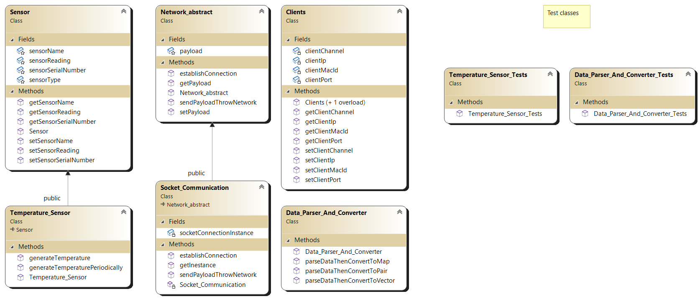
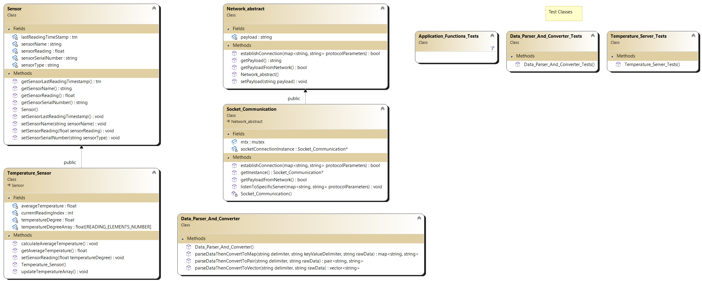

# Forest Forcasting 

## Auther: Ahmed Eldakhly.

## Description:
- With climate changing, we need to monitor the forest all the time to avoid fires than can happen by the high temperature.
- To achieve that we need to spread many Temperature sensors around the forest, this sensor connect to the Server Node than can collect the data from the sensor and send it to the client
- Each server is connected with only one Temperature sensor.
- the server is available for all clients to communicate with and the communication will start from client side and the server will save the information for each registered client to send new temperature periodically.
- the client will communicate with many sensors and get readings from all of the to keep monitoring the status of the forest and make quickly decision in case the danger raise.

## System Capability:
**The server:**
- server will get new temperature each one second and send it to all registered clients.

**The client:**
- The client will get new temperature from all server nodes periodically.
- each 5 seconds the client will calculate the average of last 5 readings from each node to get more accurate reading.
- each 5 seconds the client will calculate the average of all nodes averages to have overview about the status of the foreast.
The client shall print the calculations each 5 seconds. 

## System specifications:
- Used programing language: C++
- Used network communication: Socket communication protocol.

## Assumtions
**The server:**

1. There is no real temperature sensor so we simulate it by temperature generation function.
2. A new temperature will be generated each 1 second using seperated thread. 
3. The data will be sent as string with two delimiters:
    - "," to seperate between different attributes.
    - ":" to seperate between the key and the value for each attributes.

**The client:**

1. A new temperature will be received each 1 second from each server. 
2. The data will be received as string with two delimiters:
    - "," to seperate between different attributes.
    - ":" to seperate between the key and the value for each attributes.
3. calculation will be calculated each 5 seconds and will display on the screen.
4. the calculations are:
    - average of last 5 readings for each servers to get right temperature.
    - average of all average readings from all servers

## System Architecture

## System Components

## System Implementation
### Server Class Digram

### Client Class Digram

## Implementation documents
- Generated by Doxygen tool.
**The server document:**
[Server implementation document](ReadmeResources/DocumentationServer/html/index.html)

**The client document:**
[Client implementation document](ReadmeResources/DocumentationClient/html/index.html)